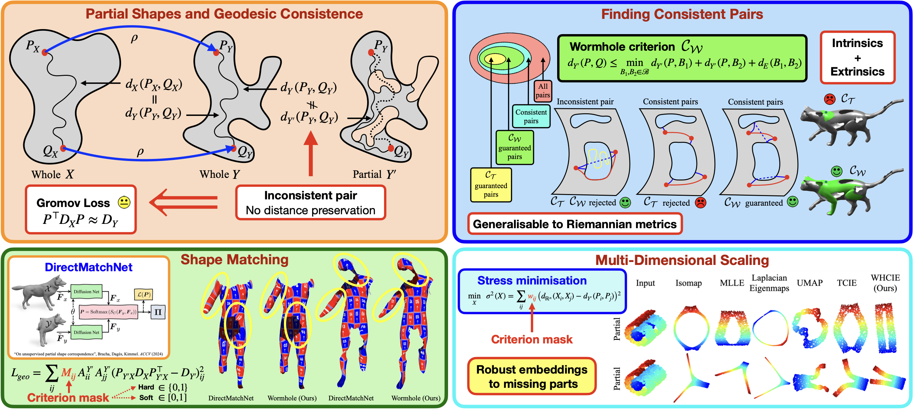

# Wormhole: A Novel Loss for Partial Shape Matching [\[Paper\]](https://arxiv.org/abs/2410.22899)

---

## Abstract

When matching parts of a surface to its whole, a fundamental question arises: Which points should be included in the matching process?
The issue is intensified when using isometry to measure similarity, as it requires the validation of whether distances measured between pairs of surface points should influence the matching process.
The approach we propose treats surfaces as manifolds equipped with geodesic distances, and addresses the partial shape matching challenge by introducing a novel criterion to meticulously search for consistent distances between pairs of points.
The new criterion explores the relation between intrinsic geodesic distances between the points, geodesic distances between the points and surface boundaries, and extrinsic distances between boundary points measured in the embedding space.
It is shown to be less restrictive compared to previous measures and achieves state-of-the-art results when used as a loss function in training networks for partial shape matching.

---

## Installation

1. Clone the repository

   ```bash
   git clone https://github.com/ABracha/Wormhole.git
   cd wormhole
   ```

2. Install dependencies

   ```bash
    conda create -n wormhole python=3.8 # create new viertual environment
    conda activate wormhole
    conda install pytorch cudatoolkit -c pytorch # install pytorch
    pip install -r requirements.txt
   ```

3. Download the Data\
   Download the datasets from the provided [link](https://technionmail-my.sharepoint.com/:f:/g/personal/amit_bracha_campus_technion_ac_il/El8ajzrIw-tOiRU5AP9GUxwB-G85CU9ZHmJwgDLufPXTgg?e=oJr0Kq) into this directory. You can download only PFAUST data or SHREC16 data, but you need to keep the directory structrue. Otherwise, you will need to adjust the `options/{train,test}` json files accordingly.

---

## Evaluation

To evaluate our Wormhole method on benchmark datasets, follow these steps:

1. **Run Evaluation**
   Use the provided scripts to start the evaluation:
   ```bash
   python evaluate.py --config options/test/option_file.json
   ```
   Replace `option_file.json` with the appropriate configuration file for your dataset.

---

## Usage

- **Training:** Train the Wormhole model with your data using:
  ```bash
  python train.py --config options/train/option_file.json
  ```
---

## Creating new masks

To generate new masks for a dataset, run the preprocess.py file with the appropriate parameters for your dataset, ensuring that the `preprocess_mask` line is uncommented. Note that our mask generation implementation is overly simple and scales with the cube of the number of vertices, which can lead to slower performance for shapes with a large number of vertices (e.g., more than 8000 vertices). Consider using Dijkstra's algorithm twice for a considerable speed-up (see paper, we do not provide this implementation).

---

## Acknowledgement

A significant portion of the code in this repository is directly taken from the [RobustFMNet Repo](https://github.com/dongliangcao/Unsupervised-Learning-of-Robust-Spectral-Shape-Matching) of Cao et al. Unsupervised Learning of Robust Spectral Shape Matching, Transactions on Graphics (2023). which offers a very user-friendly framework for shape matching.

---
## License

This project is licensed under the MIT License. See the `LICENSE` file for details.

---

## Citation

The Wormhole paper completes our previous paper tackling shape matching with partial shapes. Thus, if you use Wormhole in your research, please cite both of our papers:

```bibtex
@article{bracha2024wormhole,
  title={Wormhole loss for partial shape matching},
  author={Bracha, Amit and Dag{\`e}s, Thomas and Kimmel, Ron},
  journal={arXiv preprint arXiv:2410.22899},
  year={2024}
}
```

```bibtex
@article{bracha2023partial,
  title={On partial shape correspondence and functional maps},
  author={Bracha, Amit and Dages, Thomas and Kimmel, Ron},
  journal={arXiv preprint arXiv:2310.14692},
  year={2023}
}
```